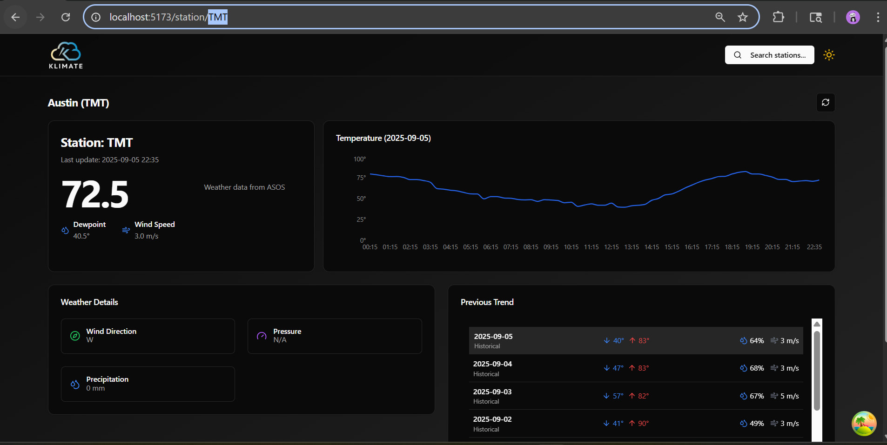

Got it 👍 — here’s a **cleaned-up README.md** without the deployment and future improvements section, and with the short tagline right at the top:

---

# 🌦️ Klimate – ASOS Weather Dashboard

**A modern weather dashboard powered by ASOS data.**

Klimate is a web application that visualizes **real-time and historical weather data** from ASOS (Automated Surface Observing Systems). It provides an interactive dashboard for exploring weather conditions at any ASOS station.

---

## 🚀 Features

* 🔍 **Station Search** – find and explore any ASOS weather station
* 🌡️ **Temperature Trends** – interactive line graph showing daily variations
* 💨 **Weather Metrics** – dewpoint, wind speed, wind direction, precipitation
* 📊 **Historical Trends** – view previous days’ weather summaries

---

## 🛠️ Tech Stack

* **Frontend**: React, TypeScript, Vite
* **Styling**: Tailwind CSS
* **Icons & UI**: Lucide React, ShadCN UI
* **Data Source**: [ASOS API](https://sfc.windbornesystems.com)

---

## 📸 Screenshots



---

## ⚡ Getting Started

1. Clone the repository:

   ```bash
   git clone https://github.com/yourusername/klimate.git
   cd klimate
   ```

2. Install dependencies:

   ```bash
   npm install
   ```

3. Run locally:

   ```bash
   npm run dev
   ```

4. Open in browser:

   ```
   http://localhost:5173
   ```

---

## 📜 License

MIT License – feel free to use and modify!

---

